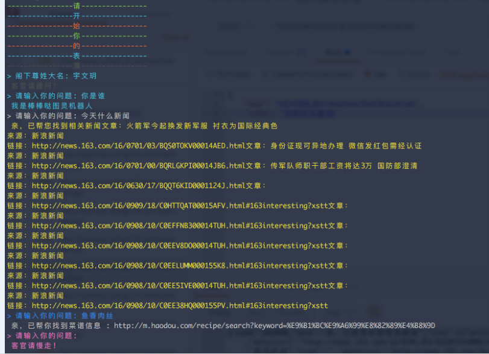

# 安装

```bash
npm install turing-robot –g
```

>提示2: 如果已经安装过 turing-robot, 请使用更新命令 `npm update turing-robot -g`

# 样例




# 感谢
感谢[图灵API](http://wap.tuling123.com/help/h_cent_webapi.jhtml?nav=doc)提供API.